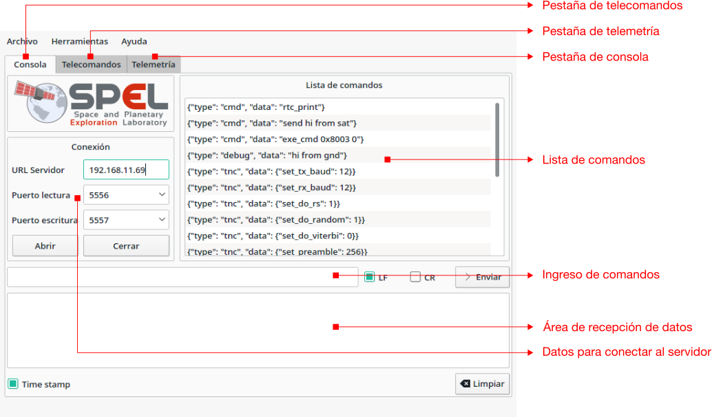
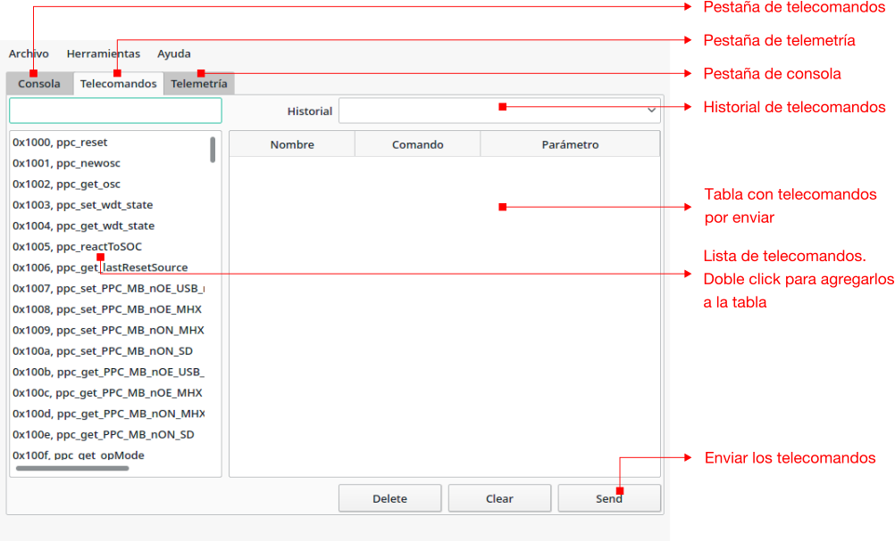
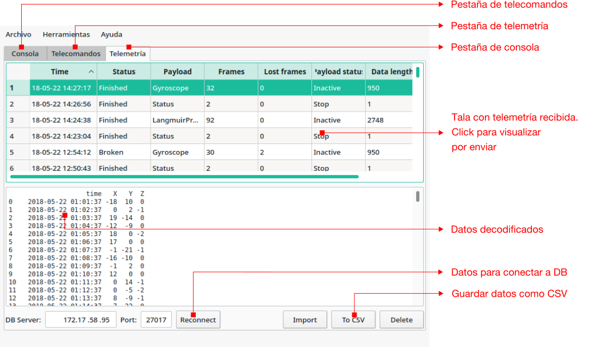

# SUCHAI Remote Gound Station Software

Este programa permite controlar y recibir los datos del nanosatélite SUCHAI.
Se conecta a través de ZMQ con el TNC físico o con GNURadio (https://github.com/spel-uchile/gr-satellites)

## Instalación

1. Instalar dependencias
    - Python (Python 3.X o 2.7.X)
    - pytohn-pip
    - python-pyqt4
    - python-sip
    
2. Ejecutar make

3. Instalar con pip

        sudo pip install dist/groundstation-0.5.X.tar.gz

## Modo de uso

1. Conectarse al servidor ZMQ. Si es un servidor remoto se debe anotar la 
dirección IP del servidor. Si la radio (TNC o GNURadio) está conectada localmente
se debe anotar 127.0.0.1. Los puertos pueden ser cambiados según la configuración
del servidor.

2. Cuando la radio recibe correctamente los datos digitales, la información 
recibida será desplegada en el área de recepción de datos de la pestaña de consola.

3. Los nuevos frames recibidos serán agrupados por tipo y fecha en la pestaña de
telemetría. Basta con seleccionar una telemetría para que el software la decodifique
y despliegue adecuadamente en el sector de datos decodificados.

4. La base de datos se configura en la pestaña de telemetría. Debe ser un servidor
MongoDB local o remoto. Si se ejecuta localmente la dirección y puerto de la base
de datos debe ser 127.0.0.1:27017. En caso contrario se debe anotar la dirección
del servidor de base de datos y presionar "Reconnect".

